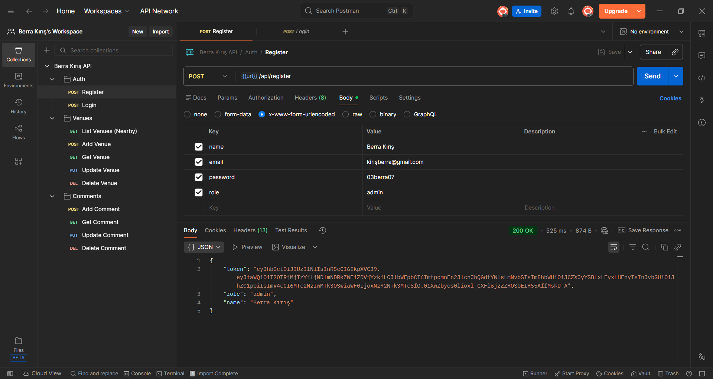
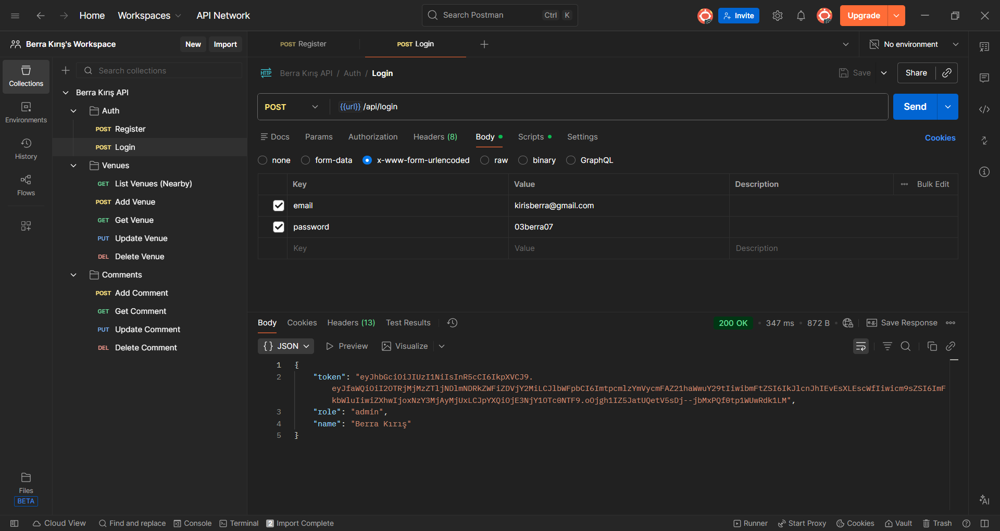
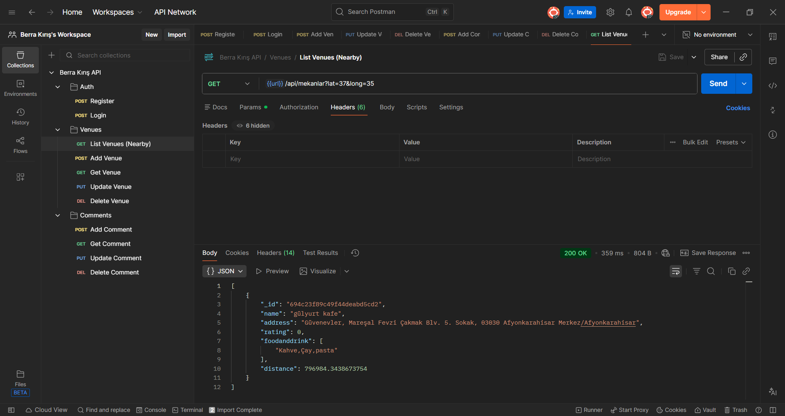
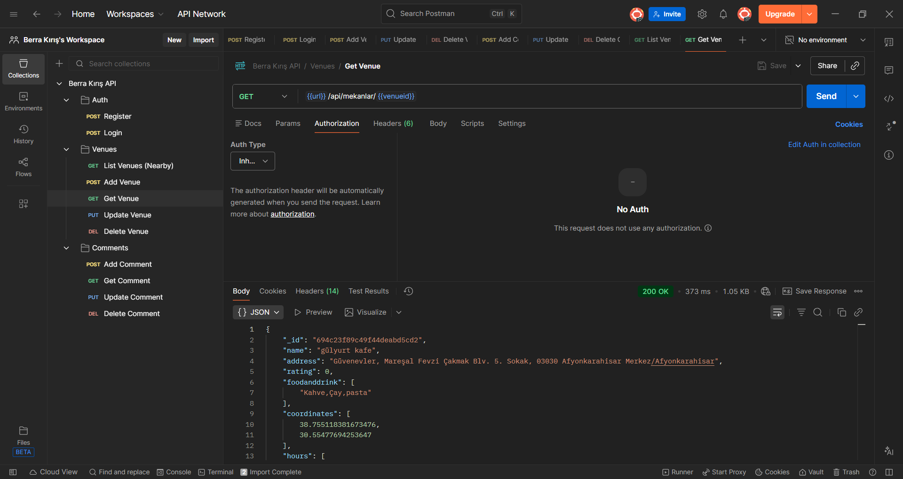
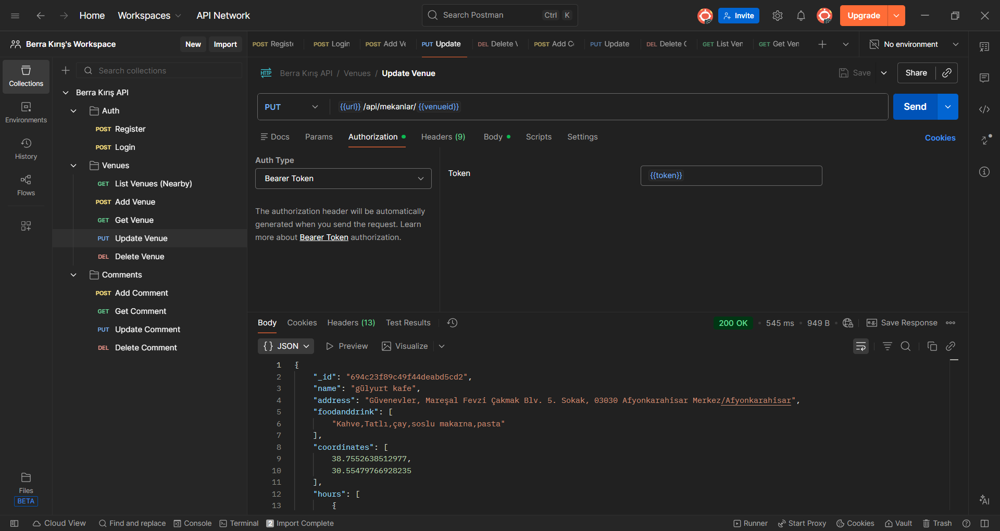
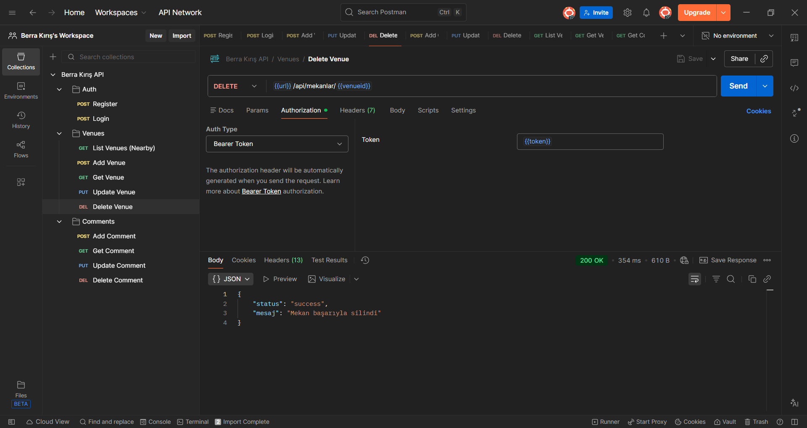
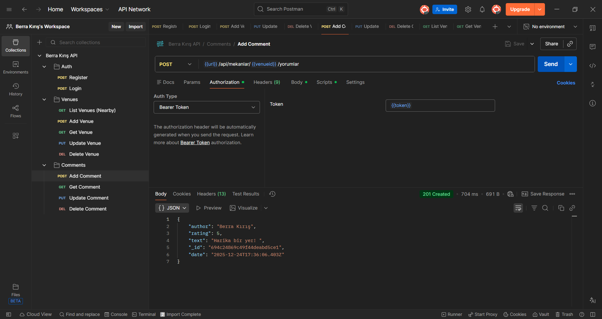
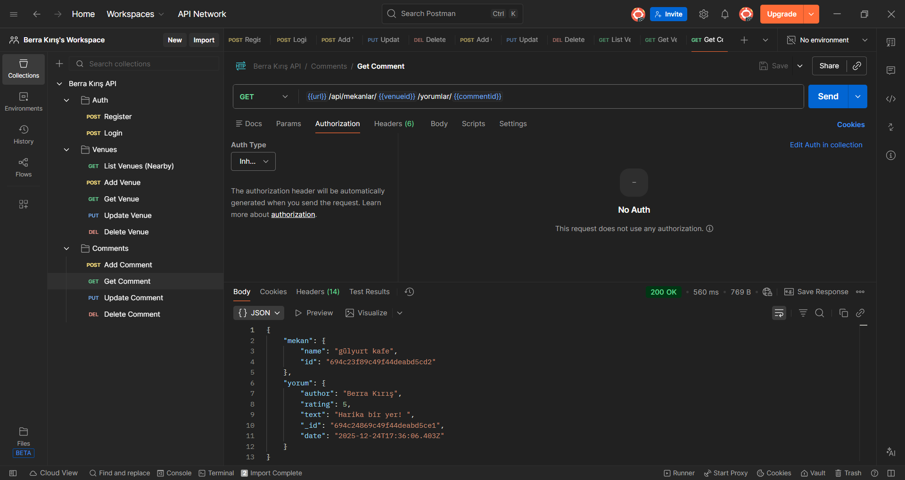
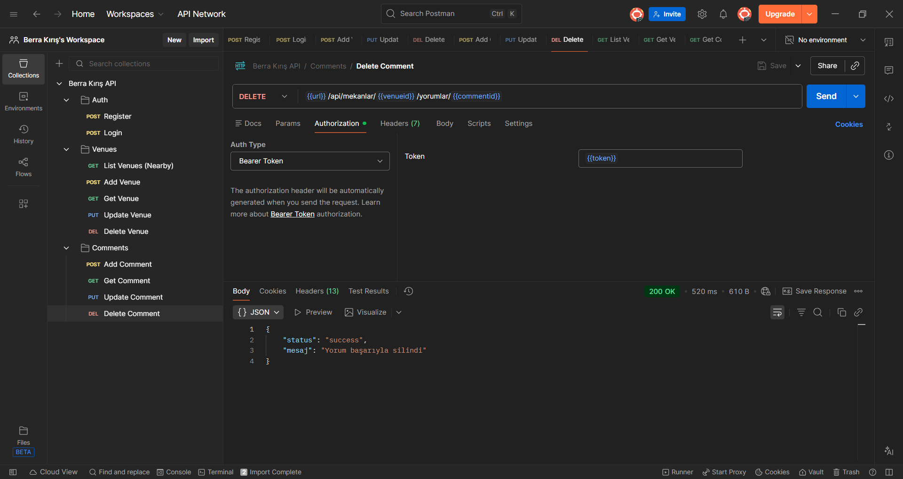

# 🗺️ Venue API & Comment Service


## 📌 Genel Bakış (Overview)

Venue API, konum tabanlı mekan keşfi, kullanıcı etkileşimi (yorumlar) ve güvenli kimlik doğrulama işlemleri için tasarlanmış modern bir backend çözümüdür. Bu servis sayesinde geliştiriciler, uygulamalarına hızlıca mekan listeleme, sosyal geri bildirim ve kullanıcı yönetim özellikleri entegre edebilirler.

🔗 **Canlı Sunucu (Production):** [https://web-main-6uw3.vercel.app](https://web-main-6uw3.vercel.app)
    
   **Backand Adresi:**[web-main-three.vercel.app](web-main-three.vercel.app)

---

## 📑 İçindekiler (Table of Contents)

1. [Kurulum (Setup)](#-kurulum-setup)
2. [🔐 Kimlik Doğrulama & Güvenlik](#-kimlik-dogrulama--guvenlik-authentication--security)
3. [API Özeti (API Summary)](#-api-özeti-api-summary)
4. [Görsel Rehber (Visual Guide)](#-görsel-rehber-visual-guide)
5. [Lisans (License)](#-lisans-license)

---

## ⚡ Kurulum (Setup)

Geliştirme ortamınızı hazırlamak için aşağıdaki komutları sırasıyla terminalinizde çalıştırın.

```sh
# 1. Projeyi yerelinize çekin
git clone <repository-url>

# 2. Proje klasörüne geçiş yapın
cd proje-klasoru

# 3. Gerekli paketleri yükleyin
npm install

# 4. Çevresel değişkeleri (.env) ayarlayın
# (Örnek: JWT_SECRET=gizliAnahtar, dbURI=mongodb+srv://...)

# 5. Uygulamayı başlatın
npm run start
```

---

## 🔐 Kimlik Doğrulama & Güvenlik (Authentication & Security)

Bu proje, güvenli veri erişimi sağlamak için **JSON Web Token (JWT)** standardını kullanır.

*   **Kayıt Ol & Giriş Yap:** Kullanıcılar e-posta ve şifreleri ile sistemde hesap oluşturabilir ve giriş yapabilirler.
*   **Token Yönetimi:** Başarılı bir giriş işleminden sonra sunucu, kullanıcıya benzersiz bir `Bearer Token` döner.
*   **Korunan Rotalar:** Mekan ekleme/güncelleme/silme ve yorum yapma gibi işlemler, istek başlığında (Header) geçerli bir token gönderilmesini zorunlu kılar.
*   **Rol Tabanlı Erişim:** Sadece 'admin' yetkisine sahip kullanıcılar mekanlar üzerinde değişiklik yapabilir. Standart kullanıcılar yorum yapabilir ve mekanları görüntüleyebilir.

**Örnek Header Kullanımı:**
```
Authorization: Bearer <tarafınıza-verilen-token>
```

---

## 📊 API Özeti (API Summary)

| Kaynak | İşlem | Yetki (Auth) | Açıklama |
| :--- | :--- | :--- | :--- |
| **Auth** | `Register` | Herkes | Yeni kullanıcı hesabı oluşturur. |
| **Auth** | `Login` | Herkes | Giriş yapar ve JWT Token döner. |
| **Venue** | `List Nearby` | Herkes | Koordinatlara göre çevredeki mekanları getirir. |
| **Venue** | `Add` | 🔒 Admin | Sisteme yeni bir mekan kaydeder. |
| **Venue** | `Update` | 🔒 Admin | Mekan bilgilerini günceller. |
| **Venue** | `Get` | Herkes | Tek bir mekanın detaylarını sunar. |
| **Venue** | `Delete` | 🔒 Admin | Mekanı veritabanından siler. |
| **Comment** | `Add` | 🔒 User/Admin | Mekana yorum yapar (Token gerektirir). |
| **Comment** | `Update` | 🔒 User/Admin | Yorum içeriğini değiştirir. |
| **Comment** | `Delete` | 🔒 User/Admin | Yorumu kaldırır. |

---

## 📷 Görsel Rehber (Visual Guide)

API uç noktalarının nasıl çalıştığına dair ekran görüntüleri aşağıdadır.

### 🔑 Kimlik Doğrulama (Auth)

#### Kayıt Ol (Register)
Ad, e-posta ve şifre ile yeni bir kullanıcı hesabı oluşturulur.


#### Giriş Yap (Login)
E-posta ve şifre ile giriş yapılır, karşılığında erişim için `token` alınır.


### 📍 Mekan Servisleri

#### Yeni Mekan Oluşturma
Veritabanına isim, adres, koordinat ve **çalışma saatleri** (gün/saat aralıkları) verileriyle yeni bir mekan ekler.


#### Çevredeki Mekanları Bulma
Verilen enlem ve boylam değerlerine göre yakındaki mekanları listeler.


#### Mekan Detayı
ID'si bilinen bir mekanın tüm özelliklerini görüntüler.


#### Bilgi Güncelleme
Mekan verilerinde değişiklik yapmanızı sağlar.


#### Mekan Silme
Mekanı kalıcı olarak sistemden kaldırır.


### 💬 Yorum Servisleri

#### Yorum Gönderme
Kullanıcıların mekanlara puan ve metin içeren yorum bırakmasını sağlar. Yazar bilgisi **Token** üzerinden otomatik alınır.


#### Yorum Okuma
Belirli bir yorumun detaylarını getirir.


#### Yorum Düzenleme
Mevcut bir yorumun içeriğini veya puanını günceller.


#### Yorum Kaldırma
Yorumu siler.


---
